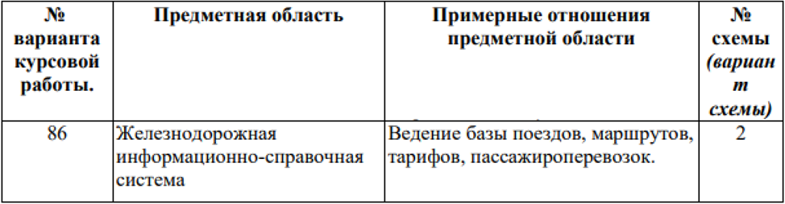
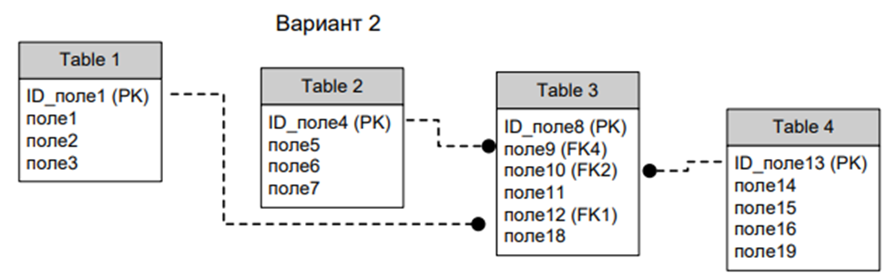

# Приложение для взаимодействия с собственной БД (в рамках курсовой работы)

## Постановка задачи

1. Постоянные таблицы и связи между ними, количество таблиц и наличие связей 
должно соответствовать заданию, допускается увеличение числа таблиц и их полей 
для более адекватного представления предметной области;
2. В приложении (на стороне клиента) реализовать не менее пяти запросов (для 
демонстрации навыков работы), которые могут реализовывать задания из п.3. 
3. Реализовать запросы по заданиям (в любых фрагментах скриптов как на стороне 
сервера, так и на стороне клиента):
   * Составной многотабличный запрос с CASE-выражением;
   * Многотабличный VIEW, с возможностью его обновления;
   * Запросы, содержащие подзапрос в разделах SELECT, FROM и WHERE (в каждом хотя бы по одному);
   * Коррелированные подзапросы (минимум 3 запроса);
   * Многотабличный запрос, содержащий группировку записей, агрегатные функции и параметр, используемый в разделе HAVING;
   * Запросы, содержащий предикат ANY(SOME) или ALL (для каждого предиката);
4. Создать индексы (минимум 3 штуки) для увеличения скорости выполнения 
запросов;
Предусмотреть индексы разных типов. Индексы должны быть созданы для 
разных таблиц. В отчет включить план запроса, показывающий применение 
индекса при выполнении запроса. 
5. В таблице (в соответствии с вариантом) предусмотреть поле, которое заполняется 
(и актуализируется) автоматически по срабатыванию триггера при добавлении, 
обновлении и удалении данных, иметь возможность продемонстрировать работу 
триггера при работе приложения. Триггеры должны обрабатывать только те 
записи, которые были добавлены, изменены или удалены в ходе текущей операции 
(транзакции).
6. Операции добавления, удаления и обновления реализовать в виде хранимых 
процедур или функций с параметрами для всех таблиц;
7. Реализовать отдельную хранимую процедуру или функцию, состоящую из 
нескольких отдельных операций в виде единой транзакции, которая при 
определенных условиях может быть зафиксирована или откатана;
8. Реализовать курсор на обновления отдельных данных (вычисления значения полей 
выбранной таблицы);
9. Реализовать собственную скалярную и векторную функции. Функции сохранить в 
базе данных;
10. Распределение прав пользователей: предусмотреть не менее двух пользователей с 
разным набором привилегий. Каждый набор привилегий оформить в виде роли.

## Схема базы данных

